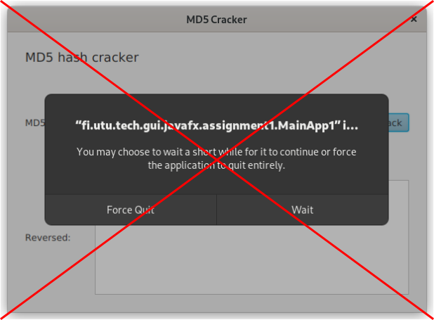
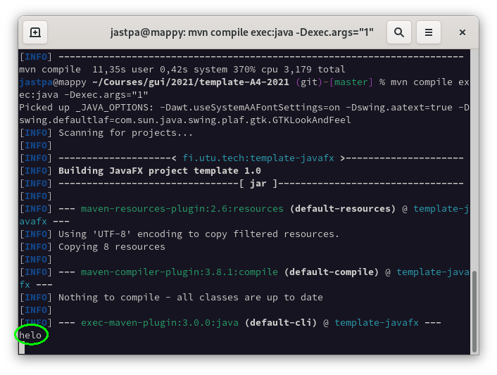
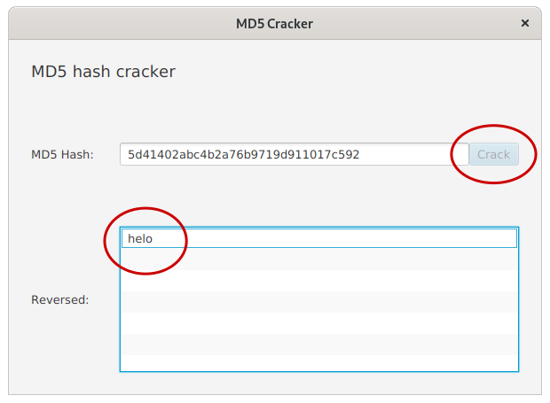
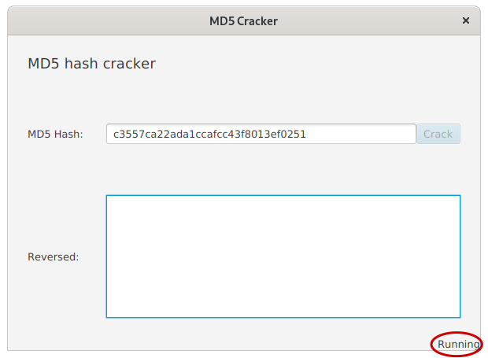
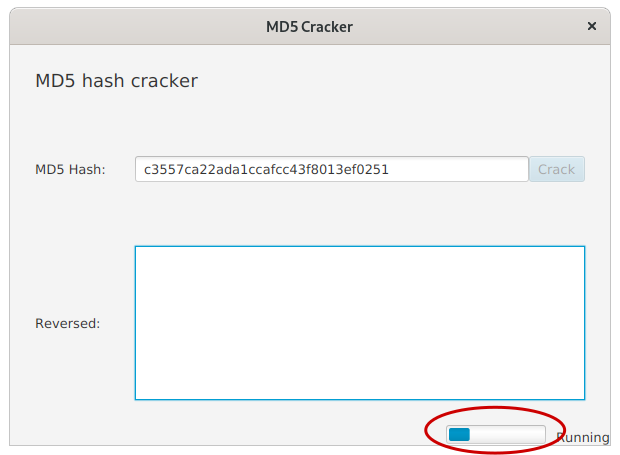
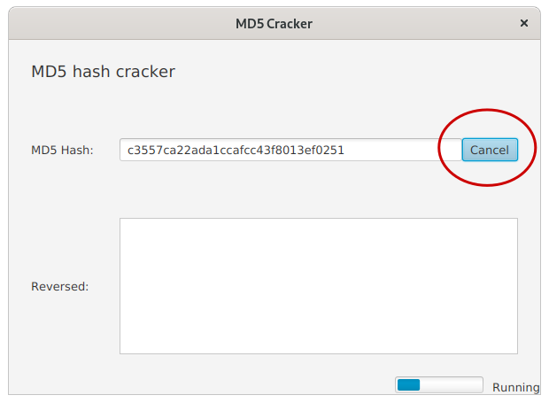
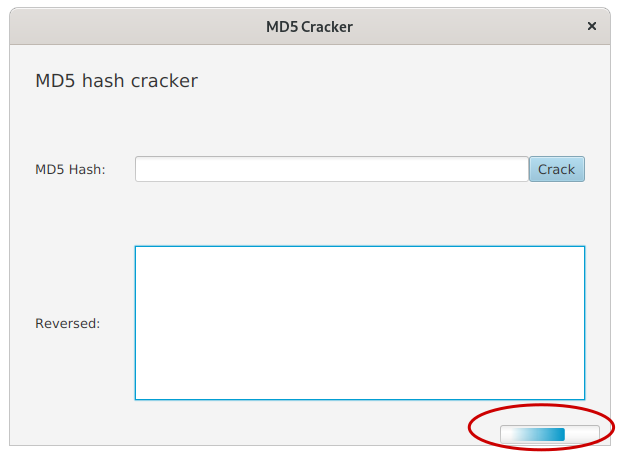

# Assignment A4

This week we will be mainly concentrating on concurrency in graphical applications using abstractions provided by Java and JavaFX. These abstractions include threads, Runnable, Task and Service objects.

## Background
The theme of this week's assignment is reversing hashes created by MD5 algorithm back into the their original values using brute force method. "Cracking" in laymans terms. Completing the assignment does not require understanding in hashing but some context is always good to have.

Saving passwords is one application of hashing algorithms. When saving passwords, the original password will be hashed using a hashing algorithm (such as MD5) and the resulting hash is the one to be saved into the database. One property of hash algorithms is that they are "one way funtions": Given the input value, the output is easily calucated. But given only the output value (the hash), there is no easy way to determine the original input value. In case of data breach where the password database gets stolen, this will make determining the actual passwords hard or even impossible given the quality of the original password.

- `qwertyui -> 22d7fe8c185003c98f97e5d6ced420c7` fast
- `22d7fe8c185003c98f97e5d6ced420c7 -> qwertyui` slow

In brute force, the basic idea is that multiple input values are generated, hashed and then matched against the hash we want to reverse. If a match is found, then the original value is found as well. Given the amount of characters and the length of input values to try, this may take a lot of time or result in not finding the value.

*Disclaimer: Using this method, it is possible to reverse passwords if the hash is available. This should go without saying, but in case of a data breach cracking passwords and other actions that violate data privacy are still illegal, even they'd be possible in theory. As experts-to-be in this field, it is good for you to understand these methods to avoid making mistakes in your own software though. At least you should now understand the value of a good password.*

## General instructions
The sub-assignments should be done in their respective folders (in the src/main source tree): the first assignment of A4 should be done in folder "assignment1", the second assignment of A4 in "assignment2" and so on (figure). **As previously**, some of the files need to be located under `src/main/resources`. This is mostly to do with FXML files.


A specific assignment to be started can be executed by giving the assignment number as a command line argument.

Using maven to compile and run:

```
mvn compile exec:java -Dexec.args="assignmentnumber"
```

E.g. for compiling and executing assignment 3:

```
mvn compile exec:java -Dexec.args="3"
```

Your IDE of choice (Eclipse, VSCode, IntelliJ) has their own way of specifying command line arguments. Refer to their documentation in case you're not familiar with them.

## Usage instructions
You may test the application by pasting hashes into the textfield and pressing the "Crack" button. You may generate hashes by using the MD5 hash generator from the previous excercises or using terminal (works out-of-box with UTU virtual machine):

`echo -n inputvalue | md5sum`

The `-n` parameter omits the line break from the input value which would add 1-2 characters to the input value otherwise.

If you do not want to generate your own inputs, try these:

- `2510c39011c5be704182423e3a695e91` - h
- `6f96cfdfe5ccc627cadf24b41725caa4` - he
- `46356afe55fa3cea9cbe73ad442cad47` - hel
- `c3557ca22ada1ccafcc43f8013ef0251` - helo
- `5d41402abc4b2a76b9719d911017c592` - hello

You may change the maximum length of generated input values by changing the `depth` value of `bruteForce` method call. Lengths of 3-4 are tolerable. Five starts to be too long time-wise. For some perspective, using the built-in dictionary, depth of 4 will test 23,000,461 input values whereas depth of 5 the amount of input values has risen into 1,587,031,810.


## Assignment 1 - Threading the cracker (0.5p)
In assignment 1 there is an UI already provided along with the class for cracking md5 values and an example of its usage. In assignment 1 **the result will be printed into terminal, not to the GUI**.

The challenge in assignment 1 is that the user interface will not respond during the cracking process. You should modify the application to run the cracking in an external thread using Runnable interface to allow the interface respond to the user during the processing.

The result should be still printed to the terminal after the cracking is ready.

 


## Assignment 2 - Living on the edge - Updating GUI with NO regard to thread safety (0.5p)
As in the assignment 1, the UI is not responding here either. The difference between the two is that instead of printing the result into terminal, it is actually being added to the ListView component, `reversedList` here. Again, you should modify the application to run the cracking in a separate thread using Runnable interface. In addition, the "Crack" button should be disabled (`setDisabled(true)`) during the cracking process. Once the cracking has finished, the button should become active again.

In this assignment you do not need to care about thread safety and you may update the JavaFX components straight from the external thread. This will be a conversation topic during the demonstrations. Please note that this can affect the stability of the application and throw random exceptions.




## Assignment 3 - Back to the thread safety (0.5p)
In assignment 2, we updated the GUI without considering thread safety. In reality though, modifying JavaFX components that are being used by the JavaFX Application thread is not allowed straight from the external threads. Sometimes it might work but then again you will face some interesing and random bugs from time to time. Basically it is like playing Russian roulette [and betting the stability of your application.](https://imgur.com/7Cgbhma).

Modify the application to use thread safe methods in updating the UI components. You may use the assignment 2 as a basis for modifications. Externally the application will look the same as in the screenshot of assignment 2.

*Hint: Platform.runLater()*

## Assignment 4 - Tasks (0.5p)
Modify the class `HashCrackerTask` to work as a JavaFX Task. Use events provided by `Task` to update the GUI components once the cracking has finished. You may use the same event handler to re-enable the disabled button after the task finishes.

To be absolutely clear; you should **NOT** use `Platform.runLater()` during this assignment but rather use mechanisms provided by the `Task` class to communicate between the external thread and the JavaFX Application thread.

Externally the application looks exactly as the one in assignment 2.


## Assignment 5 - Status updates (0.5p)
Let's continue where we left on the assignment 4. In this assignment you should send status updates from the hash cracking task, using the methods provided by `Task` class. In UI side of things you should bind (using property binding) the `statusLabel` component to the messages sent by your hash cracking task, thus updating the label automatically once a new status is updated. Please note that `runLater()` should not be used any more in this assignment (nor in the ones after this).

The status messages should be as follows:
- *Initializing* when the bruteForce is being prepared
- *Running* when the computation is starting
- *Ready* when the computaion has finished



## Assignment 6 - We're making some progress (0.5p)
Continuing from assignment 5. The UI template for this assignment has got a progress bar included. The progress bar is named `crackingProgressBar` and it should be updated with the progress of the cracking task. Use methods provided by the `Task` class and property bindings to keep the progress bar up-to-date. The `Task` class has a specific method for updating progress information...



*Hint: The progress of the brute force method can be determined using the WordIterator wi: size() contains the max amount of iterations to be done and getCurrentIndex() returns the index of current iteration.*

## Assignment 7 - Please stop! (0.5p)
Let's continue from assignment 6. You are allowed to continue from assignment 4 as well if you haven't done assignments 5 or 6. Add the following functionality to the application: allow the user to cancel the hash cracking task by a click of a button. The Crack button should read "Cancel" when the cracking task is running, otherwise it should read "Crack". When the task is running, the button should cancel the task, otherwise it should start the task.

For cancelling the task, use methods provided by the Task class. Use property bindings to modify the text on the Crack button. Ie. bind the textProperty of the button to the running property of the task.




## Assignment 8 - Services (0.5p)
It is recommended to base the assignment 8 on the assignment 7 for getting the most out of the Service class conversion. But feel free to use 4, 5 or 6 if you haven't done assignment 7.

Let's modify the program to utilize the Service class provided by JavaFX. Start by creating `HashCrackService` and modify it to extend the `Service` class and include the required methods. Once finished, the `HashCrackService` should provide hash cracking service by utilizing the `HashCrackTask` objects.

After having the service ready, you should refactor the controller class to utilize the new and shiny `HashCrackService`. In the end, the controller class should not have a any direct references to the `HashCrackTask` objects but rather only use the `HashCrackService` (which in turn would utilize the `HashCrackTask`s behind the curtains).

In the screenshot provided, the application is in a state where the service is available and bound to the GUI components but not a sigle task has been started yet. This is why the progress bar has the weird effect.





*Hint: It is possible to create a method `public void initialize()` to the controller class. This method will be executed every time the application is started, after initializing the FXML components. Compared to `start()` method, you have full access to private members of the controller class. Initialize() may become handly for creating services and binding them to the compontents...*
